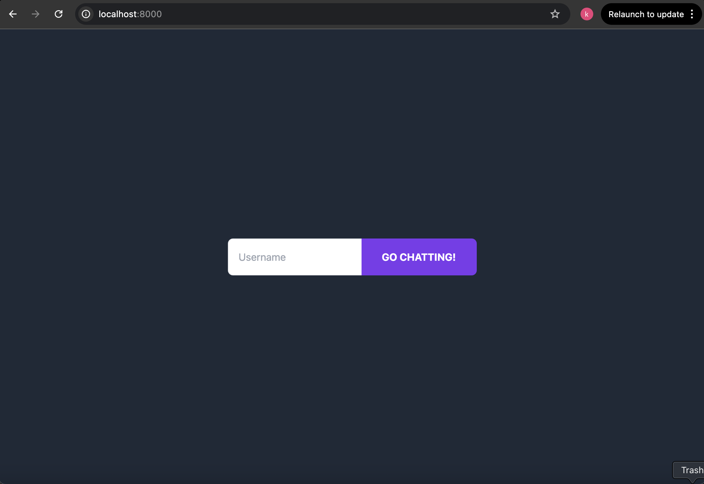
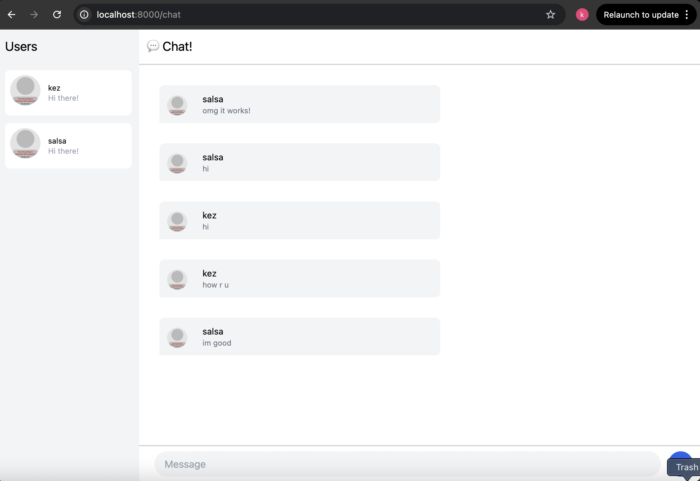
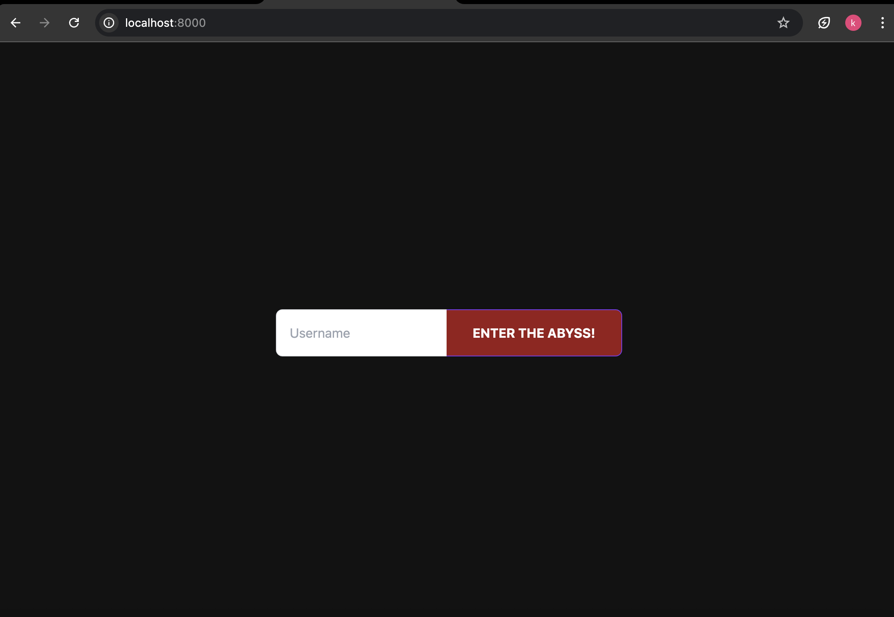
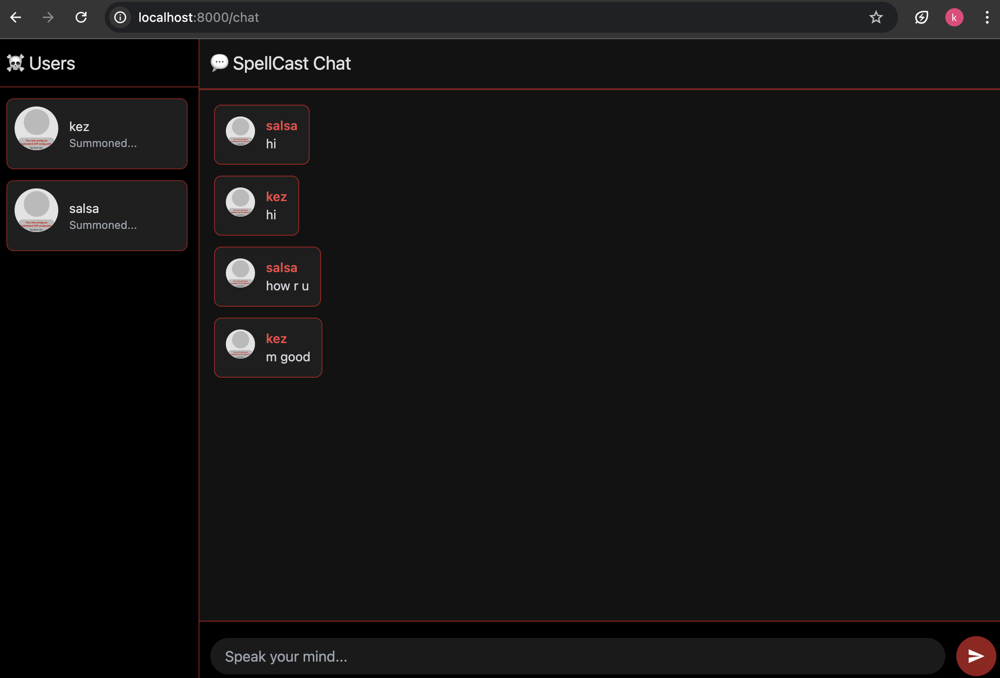

# Kezia Salsalina Agtyra Sebayang - 2306172086

### Experiment 3.1

### Experiment 3.2

I designed the interface with a dark, gothic theme that utilizes a rich, muted color scheme and dramatic red accents to emphasize details across the layout. I also incorporated textured backgrounds and refined button styles to add depth and visual interest. Additionally, I implemented smooth hover effects and subtle transitions on interactive elements, ensuring an engaging and intuitive user experience.